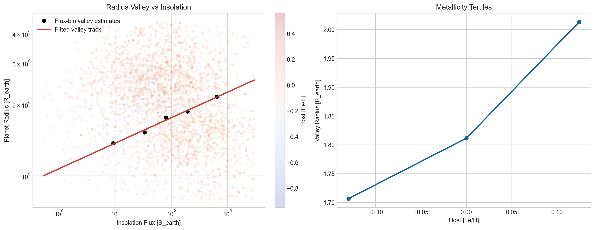
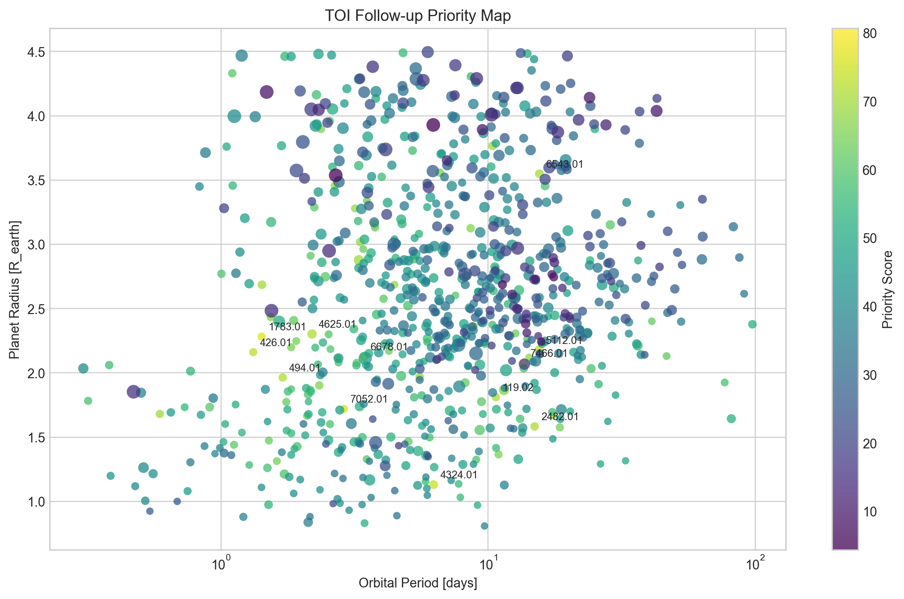

# NASA Exoplanet Research

Reproducible exoplanet-population analysis built on the NASA Exoplanet Archive.

This repository does two things:

1. Re-estimates the exoplanet radius valley for close-in small transiting planets.
2. Ranks current TESS Objects of Interest (TOIs) by follow-up value for population-level science.

The project is designed as a compact public research repo: the raw NASA snapshots used for the current run are included, the analysis is scripted end-to-end, and the main figures and ranked target tables are already generated.

## What This Repository Studies

The radius valley is the deficit of planets between the super-Earth and sub-Neptune populations. Its location is astrophysically important because it constrains atmospheric loss, core composition, and planet formation history.

This repository asks three practical questions:

1. How does the radius valley move with stellar irradiation in the latest confirmed transiting-planet sample?
2. Is there a detectable metallicity dependence in the radius valley?
3. Which unconfirmed TOIs would produce the highest information gain if they are validated and characterized?

The workflow uses two public NASA Exoplanet Archive tables:

- `PSCompPars` for confirmed planets
- `TOI` for TESS planet candidates

## Current Snapshot Results

The committed outputs in this repository come from the run archived on `2026-04-10`.

- Confirmed sample size: `2,896` planets
- TOI candidate sample size: `854` candidates
- Best-fit irradiation relation:
  `log10(R_valley / R_earth) = 0.030 + 0.108 * log10(S / S_earth)`
- Valley radius increases from about `1.37 R_earth` in the lowest irradiation bin to `2.16 R_earth` in the highest irradiation bin
- A metallicity trend is also visible, with the valley shifting from `1.71 R_earth` to `2.01 R_earth` across host-metallicity tertiles

Interpretation:

- The irradiation dependence is strong and robust in this sample.
- The metallicity dependence is suggestive, but less secure than the irradiation trend.
- The TOI ranking is intended for follow-up triage, not as a formal validation-probability model.

## Figures

### Radius Valley Overview



This figure shows:

- Confirmed small transiting planets in radius-irradiation space
- A binned empirical estimate of the radius valley
- A fitted valley track as a function of stellar irradiation
- A metallicity-split view of the valley location

### TOI Follow-up Priority Map



This figure shows:

- Current TOI candidates in period-radius space
- Bubble size tied to transit depth
- Color tied to the follow-up priority score
- Labels for the highest-scoring targets

## Repository Layout

- `README.md`
  Public overview, methodology, and reproduction guide.
- `REPORT.md`
  Human-readable summary of the current archived run.
- `scripts/fetch_nasa_exoplanet_data.sh`
  Downloads fresh CSV snapshots from the NASA Exoplanet Archive TAP service.
- `src/nasa_exoplanet_research.py`
  Main analysis pipeline.
- `data/raw/`
  Raw NASA CSV snapshots used by the pipeline.
- `data/processed/`
  Cleaned analysis tables generated from the raw snapshots.
- `results/`
  Figures, ranked target lists, summary JSON, and intermediate result tables.

## Main Outputs

After running the pipeline, the main deliverables are:

- `results/radius_valley_overview.png`
  Main scientific figure for the radius valley and metallicity trend.
- `results/toi_priority_map.png`
  Visualization of the candidate ranking.
- `results/top_candidates_overall.csv`
  Ranked list of all retained TOI candidates.
- `results/top_radius_valley_probes.csv`
  High-priority TOIs located near the predicted radius valley.
- `results/top_temperate_sub_neptunes.csv`
  High-priority cooler sub-Neptune targets.
- `results/flux_binned_valleys.csv`
  Radius-valley estimates in irradiation bins.
- `results/metallicity_binned_valleys.csv`
  Radius-valley estimates in metallicity bins.
- `results/research_summary.json`
  Machine-readable summary of the full run.

## Methodology

### 1. Confirmed-planet sample selection

The analysis restricts the NASA `PSCompPars` table to transiting planets that satisfy:

- `0.8 < R_p < 4.5 R_earth`
- `0.3 < P < 100 days`
- `0.5 < S < 3000 S_earth`
- `st_rad < 1.8 R_sun`
- `3200 < T_eff < 7200 K`

This keeps the sample focused on the compact-planet regime where the radius valley is relevant and avoids pushing too far into giant-planet or strongly evolved-star parameter space.

### 2. Radius-valley estimation

For a given subsample, the code:

- takes the planet-radius distribution
- applies a Gaussian kernel density estimate
- identifies the super-Earth peak and the sub-Neptune peak
- defines the radius valley as the density minimum between those peaks

This is repeated across bins in irradiation and metallicity.

### 3. Irradiation trend fit

The confirmed-planet sample is split into irradiation quantile bins. The code estimates the valley in each bin and fits a linear relation in log space:

`log10(R_valley) = a + b * log10(S)`

Bootstrap resampling is used to estimate uncertainty on the fitted slope and intercept.

### 4. Metallicity split

The confirmed sample is also split into host-metallicity tertiles. The code then measures how the valley shifts between low-metallicity and high-metallicity hosts.

This is a deliberately simple empirical test. It is useful for hypothesis generation, but it is not a replacement for a full hierarchical or selection-corrected population model.

### 5. TOI ranking

Each TOI is ranked with a composite score that combines:

- novelty relative to the confirmed-planet population
- target brightness
- transit depth
- closeness to the predicted radius valley

The implemented weighting is:

- novelty: `0.35`
- brightness: `0.30`
- valley proximity: `0.25`
- transit depth: `0.10`

The output is a practical follow-up ranking for targets that are likely to be scientifically informative.

## Environment and Requirements

The code is intentionally lightweight. It uses:

- Python 3
- `numpy`
- `pandas`
- `scipy`
- `matplotlib`

The repository does not currently pin a full environment file. If you want a minimal setup, install the packages above in any standard Python environment.

For this repository, a simple dependency file is included:

```bash
pip install -r requirements.txt
```

## Quick Start

### 1. Clone the repository

```bash
git clone https://github.com/nktkt/nasa-exoplanet-research.git
cd nasa-exoplanet-research
```

### 2. Fetch the latest NASA snapshots

```bash
bash scripts/fetch_nasa_exoplanet_data.sh
```

This step queries the NASA Exoplanet Archive TAP endpoint and writes fresh CSV files into `data/raw/`.

### 3. Run the analysis

```bash
python3 src/nasa_exoplanet_research.py
```

If you are on a headless or restricted machine, use:

```bash
MPLCONFIGDIR=/tmp/mplconfig python3 src/nasa_exoplanet_research.py
```

## Command-line Options

The main script supports a few useful options:

```bash
python3 src/nasa_exoplanet_research.py \
  --ps-file data/raw/pscomppars_small_transit.csv \
  --toi-file data/raw/toi_pc_small.csv \
  --bootstrap 120 \
  --seed 42
```

Available arguments:

- `--ps-file`
  Path to the confirmed-planet CSV snapshot.
- `--toi-file`
  Path to the TOI candidate CSV snapshot.
- `--bootstrap`
  Number of bootstrap iterations used for uncertainty estimates.
- `--seed`
  Random seed for reproducibility.

## How To Read the Outputs

### `radius_valley_overview.png`

Use this figure to answer:

- whether the valley moves upward with irradiation
- whether metallicity tertiles show a coherent shift
- whether the confirmed sample visually supports the fitted trend

### `top_candidates_overall.csv`

Use this table when you want:

- a full ranked target list
- TOIs near the inferred valley
- bright and high-information targets for validation follow-up

### `research_summary.json`

Use this file when you want:

- machine-readable summary statistics
- fit coefficients
- bootstrap-based uncertainty summaries
- the top-ranked targets in a structured format

## Top Targets From the Archived Run

Highest-scoring radius-valley probes:

1. `TOI 7466.01`
2. `TOI 1783.01`
3. `TOI 426.01`
4. `TOI 494.01`
5. `TOI 119.02`

Highest-scoring temperate or cooler sub-Neptune targets:

1. `TOI 6678.01`
2. `TOI 5112.01`
3. `TOI 1027.01`
4. `TOI 5807.01`
5. `TOI 3353.02`

For the full numbers, see:

- `results/top_radius_valley_probes.csv`
- `results/top_temperate_sub_neptunes.csv`
- `REPORT.md`

## Data Sources

Primary sources:

- NASA Exoplanet Archive `PSCompPars`
- NASA Exoplanet Archive `TOI`

Official documentation:

- PS/PSCompPars column definitions:
  https://exoplanetarchive.ipac.caltech.edu/docs/API_PS_columns.html
- TOI column definitions:
  https://exoplanetarchive.ipac.caltech.edu/docs/API_TOI_columns.html
- NASA Exoplanet Archive home:
  https://exoplanetarchive.ipac.caltech.edu/

## Scientific Scope and Limitations

This repository is useful as a transparent empirical workflow, but it is intentionally not the final word on exoplanet demographics.

Important limitations:

- no explicit completeness correction
- no forward model of survey selection effects
- no hierarchical population inference
- no formal treatment of false-positive probabilities in the TOI ranking
- metallicity trend should be interpreted as suggestive rather than definitive

In other words, this repository is best used for:

- reproducible exploratory research
- target triage
- figure generation
- rapid follow-up planning

It should not be presented as a fully debiased occurrence-rate analysis.

## Reproducibility Notes

- Data acquisition is intentionally done with `curl` through the shell script.
- The Python analysis reads local CSV files only.
- The committed `data/` and `results/` directories make the current archived run inspectable without re-querying NASA.

## Possible Next Steps

Natural extensions for this repository include:

- adding completeness corrections
- incorporating mass measurements and density-based classification
- adding host-age or stellar-type splits
- generating JWST or RV follow-up specific rankings
- exporting publication-ready tables

## Development

Basic local validation:

```bash
python3 -m py_compile src/nasa_exoplanet_research.py
pytest -q
```

Continuous integration is configured in `.github/workflows/ci.yml` and runs on every push and pull request.

## Citation

If you use this repository in derivative work, cite:

- the NASA Exoplanet Archive as the primary data source
- this repository for the analysis workflow and target-ranking implementation
